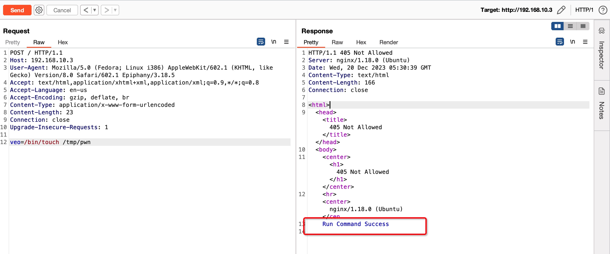
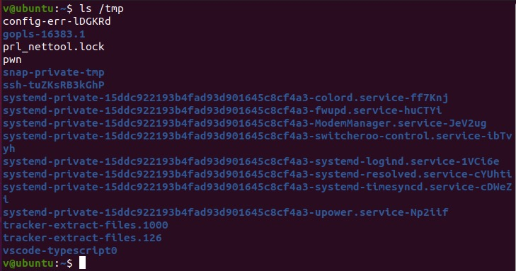

# 全链路内存马系列之 ebpf 内核马

其他内存马
- [nginx 内存马](https://github.com/veo/nginx_shell)
- [websocket 内存马](https://github.com/veo/wsMemShell)
- ### 注意
本项目不含有完整的利用工具，仅提供无害化测试程序、防御加固方案，以及研究思路讨论
- ### 测试程序使用方式
下载测试程序 [releases](https://github.com/veo/ebpf_shell/releases) 并运行

POST `veo=/bin/touch /tmp/pwn`

测试程序只能使用 `/bin/touch /tmp/pwn` 命令

- ### 一、技术特点
1. 无进程、无端口、无文件（注入后文件可删除）
2. 执行命令不会新建shell进程，无法通过常规行为检测
3. 将WebShell注入内核，无法通过常规内存检测
4. 可改造内核马，适配HTTP协议以外的所有协议

- ### 二、技术缺点
1. 需要 root 权限
2. 内核版本需要大于5.2.0 (因为使用了.rodata map，不使用最低能到4.15.0)
3. 命令不是直接执行，需要等待其他进程执行命令
4. 无回显

- ### 三、技术原理
通过ebpf hook入/出口流量，筛选出特定的恶意命令。再通过hook execve等函数，将其他进程正常执行的命令替换为恶意命令，达到WebShell的效果。

- ### 四、研究中遇到的问题
#### 1. 为什么不通过ebpf直接执行命令

根据ebpf的编写规则，ebpf自己是不能执行命令的，它只能hook各种函数。所以有两种方法可以间接达到执行命令的效果

- （1）自己开一个进程，ebpf通过ebpf map传输命令参数到这个进程，通过这个进程执行命令
- （2）监听其他进程执行的命令，将其修改为恶意命令参数

#### 2. 怎么通过ebpf识别HTTP报文

XDP是读不到报文内容的，所以最底层用TC格式化HTTP报文就可以，你需要算IP header、TCP header的长度等定位包体内容。另外ebpf有循环次数限制，所以最好payload是放在包体的开头或结尾

#### 3. 怎么让ebpf脱离加载器在内核中持续运行，即使加载器程序退出

详细了解 eBPF 程序的生命周期，可参考 https://eunomia.dev/zh/tutorials/28-detach/

- ### 五、防御加固方案
1. 通过bpftool可以检测出是否有ebpf恶意程序
2. 权限收敛，收敛SYS_ADMIN、CAP_BPF等权限
3. 确认 /proc/sys/kernel/unprivileged_bpf_disabled 为 1